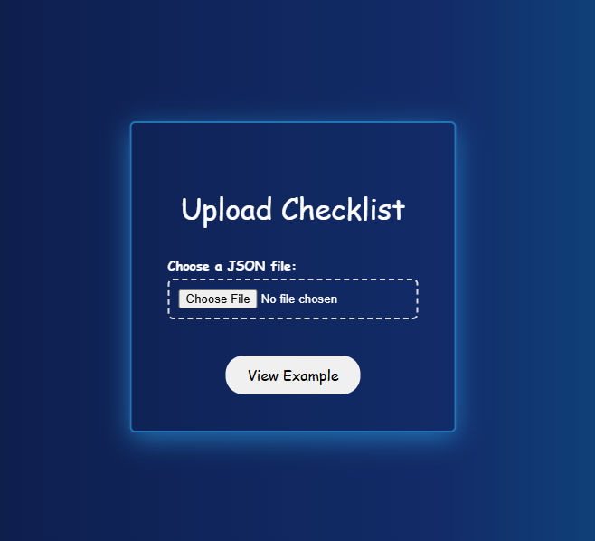

<div align="center">
    <h1>
    VE Checklist
    <h1>
    <p>Checklist Tool for OpenText ValueEdge platform.</p>
     
    <div align="center">
        
        
    </div>
</div>


## Features 🚀
- Displays relevant Definition of Done (DoD) & Definition of Ready (DOR) Checklist based on the currently opened ticket and its status.
- Reminds users to review and complete Checklist when changing ticket phases.
- Users can create their own customized Checklists based on their project requirements.
- Allows users to add completed Checklist in comments to track and maintain a record of the completion status for each item.

## How to 💡
**Use the Extension?**
* Open a ValueEdge ticket in your browser.
* Right-click anywhere on the page.
* In the context menu, you will see an option called "DoD Checklists".
* Click on it to open a pop-up displaying the Done Checklist for the ticket.


<div align="center" style="text-align: center;">
    
    
</div>


**Upload Checklist?**

Right-click the extension icon in your browser's toolbar, then select 'Options' from the menu. This will open the options page, where you can upload a new DoD file (If you encounter issues, please ensure the file is not empty and follows the below mentioned schema)

> **> Screenshot for the Upload Checklist**

#### Ticket Schema

```json
{
  "<entityName>": {
    "type": "object",
    "properties": {
      "title": {
        "type": "string",
        "description": "The title representing the type of ticket (e.g., Defect, Epic)"
      },
      "categories": {
        "type": "array",
        "items": {
          "type": "object",
          "properties": {
            "name": {
              "type": "string",
              "description": "The name of the category."
            },
            "checklist": {
              "type": "array",
              "items": {
                "type": "string",
                "description": "An individual checklist item."
              }
            }
          }
        }
      }
    }
  }
}
```
**Supported Entity Types**
 ```"Epic","Feature","Defect","Enhancement","CPE Incident","User Story","Internal","Spike","Quality Story","Task"```

**Example JSON File**

```JSON
{
   "Defect": {
      "title": "Defect",
      "categories": [
         {
            "name": "Investigation",
            "checklist": [
               "Reproduce the issue",
               "Gather logs and screenshots",
               "Determine root cause",
               "Document findings"
            ]
         },
         {
            "name": "Resolution",
            "checklist": [
               "Implement fix",
               "Run regression tests",
               "Confirm issue resolution",
               "Close defect after verification"
            ]
         }
      ]
   },
   "CPE Incident": {
      "title": "CPE Incident",
      "categories": [
         {
            "name": "Intake",
            "checklist": [
               "Log support ticket",
               "Identify user issue",
               "Classify urgency and assign priority",
               "Assign to support team"
            ]
         },
         {
            "name": "Resolution",
            "checklist": [
               "Provide solution or workaround",
               "Communicate with user",
               "Confirm issue resolution",
               "Close support ticket"
            ]
         }
      ]
   },
   "Spike": {
      "title": "Spike",
      "categories": [
         {
            "name": "Exploration",
            "checklist": [
               "Identify technical questions",
               "Review relevant documentation",
               "Build simple prototype",
               "Evaluate technical feasibility"
            ]
         },
         {
            "name": "Conclusion",
            "checklist": [
               "Summarize findings",
               "Present results to the team",
               "Document next steps",
               "Archive research notes"
            ]
         }
      ]
   }
}

```

## Contributing 🤝

We welcome contributions from everyone! Here's how you can get involved:

- **Report Issues**: Encounter a bug? Have a feature request? Open an issue on our GitHub repository to let us know.
- **Contribute Code**: Want to dive into the codebase? Check out our open issues and pull requests.Fork the repository, make your changes, and submit a pull request.
- **Suggest Improvements**: Have ideas for new features or enhancements? Share them in a new issue. Discuss potential improvements with the community.

### Please note ⚠️

- The schema is case-sensitive. Ensure that all keys and values match the required casing exactly.
- Whenever you refresh this extension, please do refresh the currently opened ValueEdge pages
